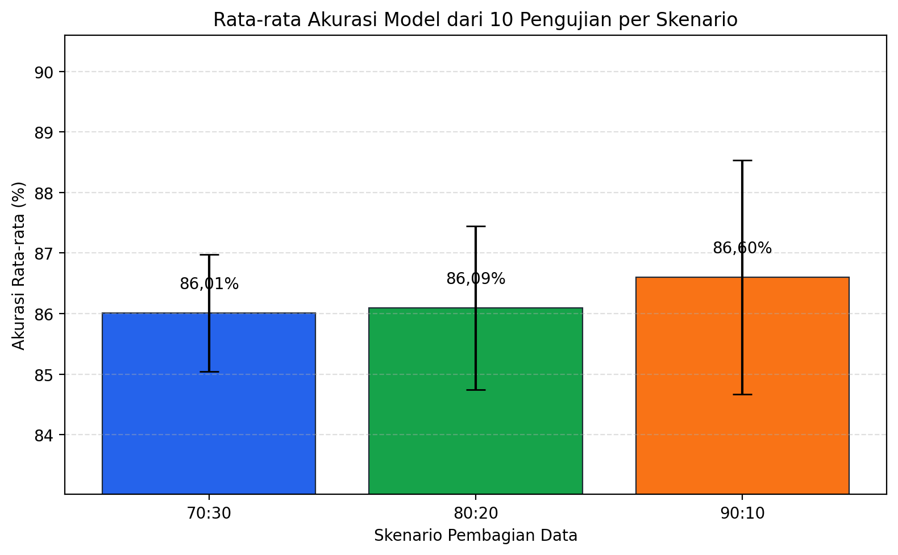

# 5.4.1 Pengujian Model

Pengujian model klasifikasi bidang penelitian dilakukan dengan menerapkan beberapa skenario pembagian data latih dan data uji, yaitu 70:30, 80:20, dan 90:10. Pengujian ini bertujuan untuk melihat performa model Support Vector Machine (SVM) dalam mengklasifikasikan skripsi mahasiswa berdasarkan judul dan abstrak ke dalam bidang penelitian yang sesuai. Sesuai dengan revisi penguji, setiap skenario pembagian data diuji sebanyak 10 kali dengan variasi pembagian data yang berbeda, sehingga total eksperimen yang dilakukan adalah 30 eksperimen. Nilai performa yang disajikan merupakan nilai rata-rata dari 10 kali pengujian pada masing-masing skenario. Hasil pengujian model pada setiap skenario pembagian data disajikan pada Tabel 5.19.

**Tabel 5.19 Hasil Pengujian Model Klasifikasi Bidang Penelitian**

| Skenario Pembagian Data | Jumlah Pengujian | Jumlah Data Latih | Jumlah Data Uji | Akurasi Rata-rata (%) | Precision Rata-rata (%) | Recall Rata-rata (%) | F1-Score Rata-rata (%) |
| --- | ---: | ---: | ---: | ---: | ---: | ---: | ---: |
| 70:30 | 10 | 2156 | 925 | 86,01 | 84,90 | 86,01 | 84,79 |
| 80:20 | 10 | 2464 | 617 | 86,09 | 84,81 | 86,09 | 84,86 |
| 90:10 | 10 | 2772 | 309 | 86,60 | 85,69 | 86,60 | 85,52 |

Berdasarkan Tabel 5.19, dapat diketahui bahwa skenario pembagian data 90% data latih dan 10% data uji menghasilkan nilai rata-rata performa terbaik dibandingkan skenario lainnya. Skenario 90:10 memperoleh nilai rata-rata akurasi tertinggi sebesar 86,60%, precision sebesar 85,69%, recall sebesar 86,60%, dan F1-score sebesar 85,52%. Hasil tersebut menunjukkan bahwa penambahan proporsi data latih dapat membantu model SVM mempelajari pola teks judul dan abstrak skripsi secara lebih optimal.

Skenario 80:20 menghasilkan performa yang cukup dekat dengan skenario 90:10, yaitu dengan rata-rata akurasi sebesar 86,09% dan F1-score sebesar 84,86%. Sementara itu, skenario 70:30 memperoleh rata-rata akurasi sebesar 86,01% dan F1-score sebesar 84,79%. Meskipun perbedaan akurasi antar skenario tidak terlalu besar, skenario 90:10 tetap menjadi skenario dengan nilai rata-rata tertinggi berdasarkan hasil 10 kali pengujian. Untuk memperjelas perbandingan performa model pada setiap skenario pembagian data, hasil pengujian divisualisasikan dalam bentuk grafik akurasi seperti ditunjukkan pada Gambar 5.5.

**Gambar 5.5 Perbandingan Akurasi Model**

Gambar 5.5 menunjukkan bahwa nilai rata-rata akurasi tertinggi diperoleh pada skenario pembagian data 90:10. Dengan demikian, berdasarkan hasil rata-rata dari 10 kali pengujian pada setiap skenario, skenario 90:10 dapat dinyatakan sebagai konfigurasi pengujian terbaik untuk model klasifikasi bidang penelitian menggunakan Support Vector Machine.
